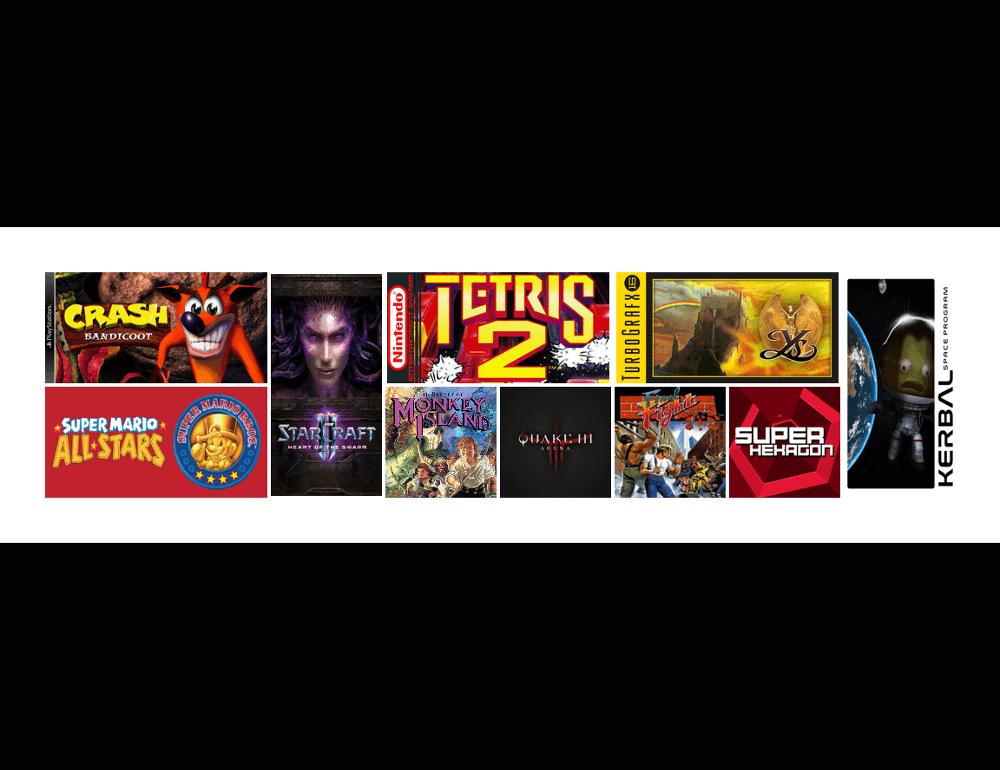

# game_grid_generator
Creates a random grid of game banners.

----------------------------------------------------------------

Include games you wish to search for inside _list_of_games.txt_

Change parameters and API_KEY in __parameters.json__

----------------------------------------------------------------

pip install python-steamgriddb
| :---:   | 

API_KEY
| :---:   | 

Generate at _https://www.steamgriddb.com/profile/preferences/api_

----------------------------------------------------------------

Run __main.py__ 

__steam.py__ is subrun. Images saved within ./STEAMIMAGES

Screenshot of grid saved in ./COLLAGE

----------------------------------------------------------------

Parameter		    						 |  Default Value | Action|Category
| :---:   | :---: | :---: | :---: |
RESIZE 	|		      							True		|						Downloaded images to be resized from original width and height.|	steam.py
DELETE_IMAGES |									True	|							Delete images from 3 root folders after making grid.|	steam.py
GENERATE_LABEL | 								False	|							Creates label on top of IMAGE canvas to indicate coordinate.|	steam.py
FULLSCREEN_WINDOW  		|					False	|							Makes tkinter root Fullscreen.|	steam.py
CLOSE_WINDOW_AFTER_SEARCH	|			False	|							Quits window after 2s of showing the grid.|	steam.py
ROW_SIZE				|								5			|							Indicates row length.|	steam.py
COLUMN_SIZE 			|							5			|							Indicates column length.|	steam.py
GRID_SIZE_IN_PIXELS 	|					128			|						Indicates width and height of image canvas resizing in pixels.|steam.py	
PADDING								|					50			|							Indicates window padding in pixels.|	steam.py
PADDING_BETWEEN_CELLS 	|				0			|							Indicates cell padding in pixels.|	steam.py
BACKGROUND_COLOR 					|	 	 "white"	|						Indicates window background color.|	steam.py
MAX_IMAGES 					|	 	 300	|						Indicates amount of aprox images to download for picking randomly.|	main.py
API_KEY 					|	 	 ""	|						Steamgriddb API_KEY.|	main.py

----------------------------------------------------------------
